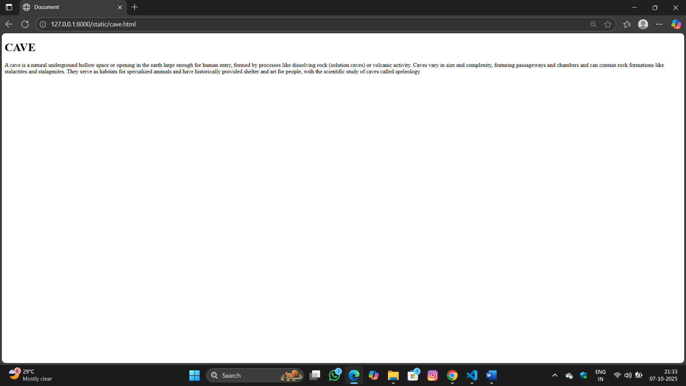
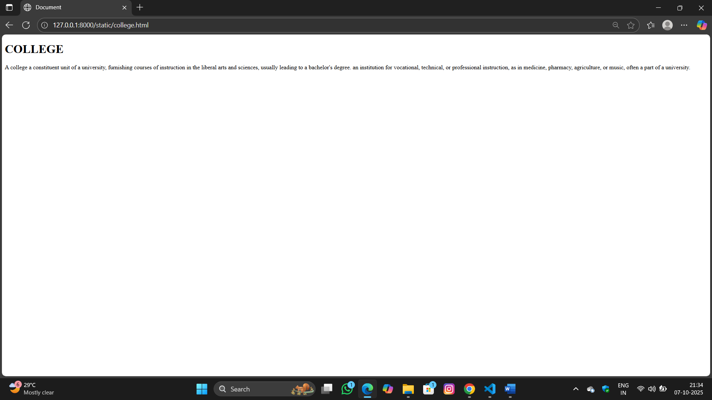
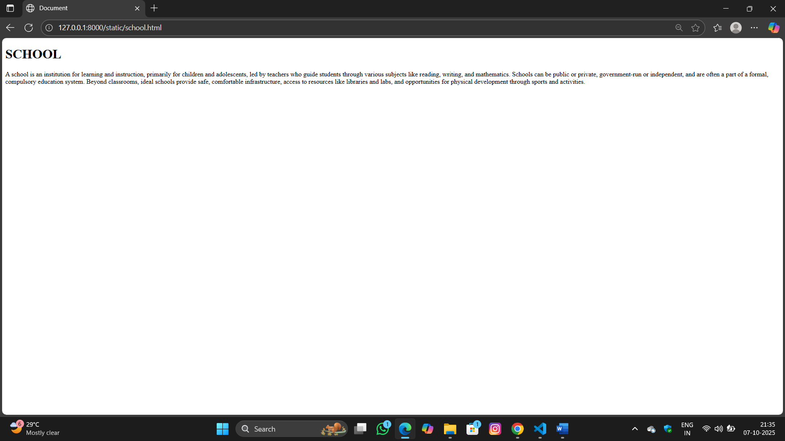
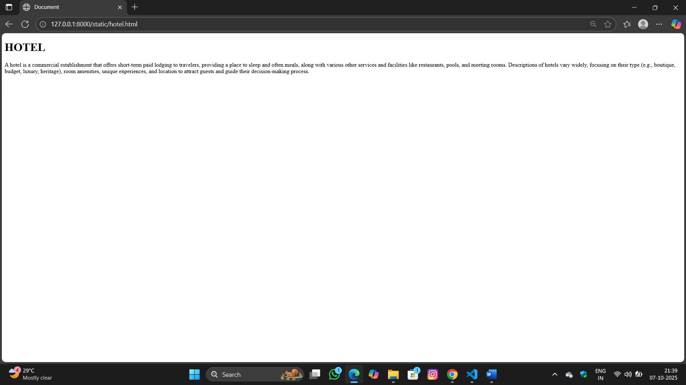
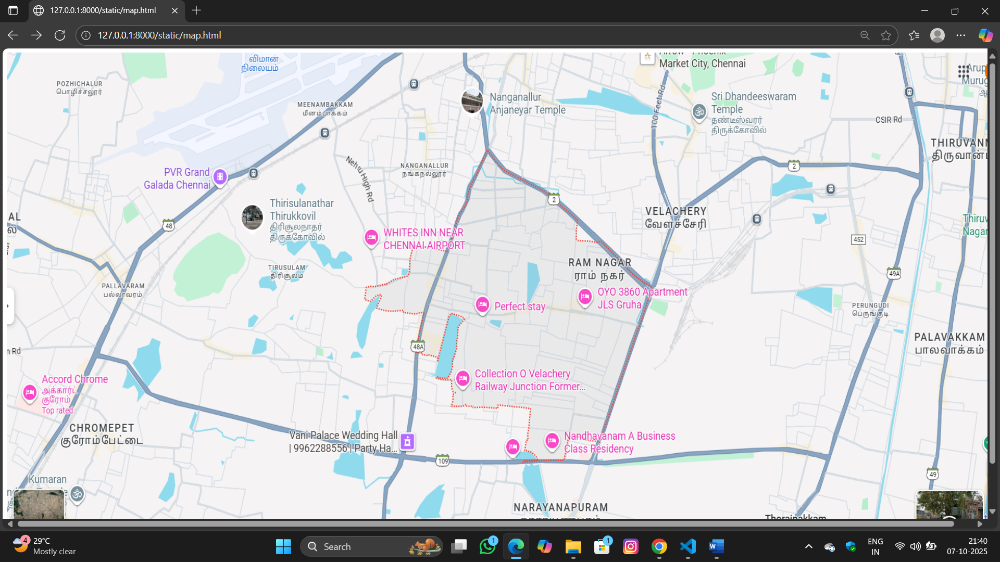

# Ex04 Places Around Me
## Date: 07/10/2025

## AIM
To develop a website to display details about the places around my house.

## DESIGN STEPS

### STEP 1
Create a Django admin interface.

### STEP 2
Download your city map from Google.

### STEP 3
Using ```<map>``` tag name the map.

### STEP 4
Create clickable regions in the image using ```<area>``` tag.

### STEP 5
Write HTML programs for all the regions identified.

### STEP 6
Execute the programs and publish them.

## CODE
'''
map.html

<!DOCTYPE html>
<html lang="en">
    <head>
    </head>
    <body>
        
<map name="image-maps-2023-04-20-084957" id="ImageMapsCom-image-maps-2023-04-20-084957">
<area  alt="" title="Arunachala Hill" href="hill.html" shape="rect" coords="942,400,798,430" style="outline:none;" target="_self"    data-maphilight='aurachala hill' />
<area  alt="" title="cave" href="cave.html" shape="rect" coords="689,489,885,565" style="outline:none;" target="_self"    data-maphilight='cave' />
<area  alt="" title="college" href="college.html" shape="rect" coords="910,725,1046,836" style="outline:none;" target="_self"    data-maphilight='college
' />
<area  alt="" title="hotel" href="hotel.html" shape="rect" coords="642,370,798,430" style="outline:none;" target="_self"    data-maphilight='hotel' />
<area  alt="" title="school" href="school.html" shape="rect" coords="230,714,470,813" style="outline:none;" target="_self"    data-maphilight='school' />
<area shape="rect" coords="1918,972,1920,974" alt="Image Map" style="outline:none;" title="Image Map" href="https://www.image-maps.com/" />
</map>
    </body>
</html>

cave.html

<!DOCTYPE html>
<html lang="en">
<head>
    <meta charset="UTF-8">
    <meta name="viewport" content="width=device-width, initial-scale=1.0">
    <title>Document</title>
</head>
<body>
    <h1>CAVE</h1>
    <p>A cave is a natural underground hollow space or opening in the earth large enough for human entry, formed by processes like dissolving rock (solution caves) or volcanic activity. Caves vary in size and complexity, featuring passageways and chambers and can contain rock formations like stalactites and stalagmites. They serve as habitats for specialized animals and have historically provided shelter and art for people, with the scientific study of caves called speleology</p>
</body>
</html>

college.html

<!DOCTYPE html>
<html lang="en">
<head>
    <meta charset="UTF-8">
    <meta name="viewport" content="width=device-width, initial-scale=1.0">
    <title>Document</title>
</head>
<body>
    <h1>COLLEGE</h1>
    <p> A college a constituent unit of a university, furnishing courses of instruction in the liberal arts and sciences, usually leading to a bachelor's degree. an institution for vocational, technical, or professional instruction, as in medicine, pharmacy, agriculture, or music, often a part of a university.</p>
</body>
</html>

hotel.html

<!DOCTYPE html>
<html lang="en">
<head>
    <meta charset="UTF-8">
    <meta name="viewport" content="width=device-width, initial-scale=1.0">
    <title>Document</title>
</head>
<body>
    <h1>HOTEL</h1>
    <p>A hotel is a commercial establishment that offers short-term paid lodging to travelers, providing a place to sleep and often meals, along with various other services and facilities like restaurants, pools, and meeting rooms. Descriptions of hotels vary widely, focusing on their type (e.g., boutique, budget, luxury, heritage), room amenities, unique experiences, and location to attract guests and guide their decision-making process. </p>
</body>
</html>

hill.html

<!DOCTYPE html>
<html lang="en">
<head>
    <meta charset="UTF-8">
    <meta name="viewport" content="width=device-width, initial-scale=1.0">
    <title>Document</title>
</head>
<body>
   <h1>HILL</h1> 
   <p>Arunachala Hills is a sacred, isolated mountain in Tiruvannamalai, Tamil Nadu, South India, revered as a manifestation of Lord Shiva and a symbol of fire and wisdom. Geologically ancient and a focal point for Shaivite spirituality, it features hermitages, springs, and forests and is central to the Arunachaleswarar Temple. The annual circumambulation of the hill, known as Girivalam, is a significant pilgrimage, and the mountain's deep mystical quality has attracted many sages, including Sri Ramana Maharshi</p>
</body>
</html>

school.html

<!DOCTYPE html>
<html lang="en">
<head>
    <meta charset="UTF-8">
    <meta name="viewport" content="width=device-width, initial-scale=1.0">
    <title>Document</title>
</head>
<body>
    <h1>SCHOOL</h1>
    <p>A school is an institution for learning and instruction, primarily for children and adolescents, led by teachers who guide students through various subjects like reading, writing, and mathematics. Schools can be public or private, government-run or independent, and are often a part of a formal, compulsory education system. Beyond classrooms, ideal schools provide safe, comfortable infrastructure, access to resources like libraries and labs, and opportunities for physical development through sports and activities.  </p>
</body>
</html>

'''

## OUTPUT


 
 
 
 
 



## RESULT
The program for implementing image maps using HTML is executed successfully.
